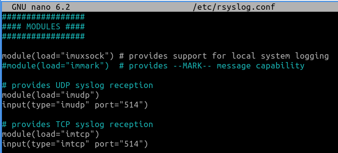
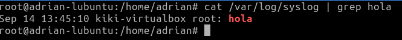
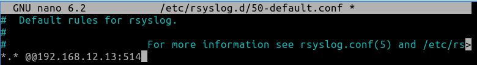

# Logs centralizados

## Introducción

Los logs centralizados son una práctica esencial en la gestión de registros informáticos. Consisten en recopilar y almacenar registros de múltiples fuentes en un único lugar, lo que facilita la supervisión, la seguridad y la resolución de problemas en entornos tecnológicos. Esta centralización ofrece ventajas clave, como una gestión más eficiente, una visión global de sistemas y una mejora en la seguridad.

* * *

## Desarrollo

### Servidor

1. Empezaremos actualizando los repositorios con un

```bash
$apt upgrade
$apt update
```

2. Instalamos las herramientas de red con 

```bash
apt install net-tools
``` 
Nos aseguramos de que las máquinas involucradas estén en la misma red.
   
3. Permitimos las conexiones TCP y UDP por el puerto 514 con los comandos: 

```bash 
$ufw allow 514/tcp
$ufw allow 514/udp
```

5. En el archivo /etc/rsyslog.conf descomentamos las líneas referentes a las conexiones UDP Y TCP y añadimos la siguiente:

> $template RemImputLogs, "/var/log/remotelogs/%FROMHOST-IP%/%PROGRAMNAME%.log" *.* ?RemImputLogs



6. Reiniciamos rsyslog con

```bash
$systemctl restart rsyslog
```

7. Para ver los registros deseados ejecutamos

```bash
$cat /var/log/syslog | grep nuestrapalabraclave
```
Ejemplo de resultado:



### Cliente

1. Igual que en el servidor debemos habilitar los puertos que vayamos a usar, en este caso el predeterminado, 514

```bash 
$ufw allow 514/tcp
$ufw allow 514/udp
```

2. Editaremos el archivo /etc/rsyslog.d/50-default.conf y añadiremos la siguiente línea, sustituyendo los siguientes campos por la ip del servidor y el puerto que estemos usando.

> *.* @@IP_DEL_SERVIDOR:NÚMERO_DE_PUERTO



3. Reiniciamos el servicio para que se apliquen los nuevos cambios

```bash
$systemctl restart rsyslog
```

* * *

## Comprobación

1. Desde el cliente enviamos un registro con logger

```bash
$logger mensaje
```
2. Para ver los registros deseados ejecutamos

```bash
$cat /var/log/syslog | grep mensaje
```
Ejemplo de resultado:


