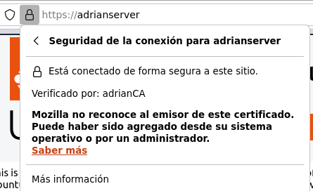

# Introducción

Un certificado SSL es crucial para la seguridad en línea, ya que cifra la información, autentica el sitio web, y protege contra la manipulación de datos. Esto inspira confianza en los usuarios, mejora el SEO y cumple con requisitos normativos.
* * *
## Desarrollo

1. Instalar Easy-RSA
   
Primero actualizamos los repositorios e instalamos easy-rsa
  ```bash
      $ sudo apt update
      $ sudo apt install easy-rsa
  ```

2. Preparar un directorio para la infraestructura de la clave pública

   Creamos el siguiente directorio
   ```bash
       $ sudo mkdir ~/easy-rsa
   ```
   En este directorio crearemos los enlaces simbólicos hacia los archivos del paquete previamente instalado
   ```bash
       $ sudo ln -s /usr/share/easy-rsa/* ~/easy-rsa
   ```
   Modificaremos los permisos para que solo el propietario pueda acceder a esta carpeta en la que se alberga la PKI
   ```bash
       $ chmod 700 /home/adrian/easy-rsa
   ```
   Ahora iniciamos la PKI en el directorio
   ```bash
       $ cd ~/easy-rsa
       $ ./easyrsa init-pki
   ```
3. Crear una entidad de certificación

  Para crear la clave privada y el certificado debemos crear el siguiente archivo con algunos valores predeterminados en la carpeta anteriormente creada
  ```bash
      $ cd ~/easy-rsa
      $ nano vars
  ```
  Debemos añadir las siguientes lineas al fichero
  ```bash
  set_var EASYRSA_REQ_COUNTRY    "SPAIN"
  set_var EASYRSA_REQ_PROVINCE   "Cuenca"
  set_var EASYRSA_REQ_CITY       "Motilla del Palancar"
  set_var EASYRSA_REQ_ORG        "AdrianCA"
  set_var EASYRSA_REQ_EMAIL      "adleobla@alu.edu.gva.es"
  set_var EASYRSA_REQ_OU         "Community"
  set_var EASYRSA_ALGO           "ec"
  set_var EASYRSA_DIGEST         "sha512"
  ```
  Para crear el certificado root público y las claves privadas para la entidad certificadora hay que ejecutar lo siguiente
  ```bash
      $ ./easyrsa build-ca
  ```
  Acto seguido, rellenamos la información que nos pide y ya tendríamos los dos archivos importantes, ~/easy-rsa/pki/ca.crt y ~/easy-rsa/pki/private/ca.key, que conforman los componentes públicos y privados de una entidad de certificación.
4. Distribuir el certificado público de su entidad de certificación

  Sin ser root ejecutaremos el siguiente comando
  ```bash
      $ cat ~/easy-rsa/pki/ca.crt
  ```
   Esto nos va dar nuestro certificado, debemos copiarlo incluyendo las líneas de BEGIN CERTIFICATE y END CERTIFICATE

   Creamos el siguiente archivo y pegamos el contenido que acabamos de cppiar.
   ```bash
      $ nano /tmp/ca.crt
   ```
   Ahora tenemos que importar el certificado y actualizar.
   ```bash
      $ sudo cp /tmp/ca.crt /usr/local
      $ sudo update-ca-certificates
   ```
   En el apartado de Firefox añadimos el certificado y ya habremos acabado con esta parte.
   
   
5. Crear CSR

   Primero instalamos OpenSSL
   ```bash
      $ sudo apt-get install openssl
   ```
   Ahora creamos un directorio para generar la clave privada
   ```bash
      $ mkdir ~/practice-rsa
      $ cd ~/practice-rsa
      $ openssl genrsa -out adrian-server.key
   ```
   Contando con la clave privada, usando de nuevo OpenSSL, creamos un CSR
   ```bash
      $ openssl req -new -key adrian-server.key -out adrian-server.req
   ```
   Copiamos el archivo al directorio temporal
   ```bash
      $ cp adrian-server.req /tmp/adrian-server.req
   ```
   
6. Firmar CSR

   Importamos la solicitudad de certificado
   ```bash
      $ cd ~/easy-rsa
      $ ./easyrsa import-req /tmp/adrian-server.req adrian-server
   ```
   Firmamos la solicitud con el siguiente comando
   ```bash
      $ ./easyrsa sign-req server adrian-server
   ```
7. Configurar Apache
   
   Editamos las lineas del archivo /etc/apache2/sites-available/default-ssl.conf.
   ```bash
   SSLCertificateFile      /etc/ssl/certs/adrian-server.crt     
   SSLCertificateKeyFile /etc/ssl/private/adrian-server.key
   ```
   Activamos el sitio SSL
   ```bash
      $ sudo a2ensite default-ssl
      $ sudo systemctl restart apache2
   ```
   Editamos el fichero /etc/hosts para añadir nuestra ip junto a nuestro nombre de certificado:
   ```bash
   10.0.2.15   adrian-server
   ```
* * *
## Comprobación

A través del navegador comprobamos que todo funcione correctamente


